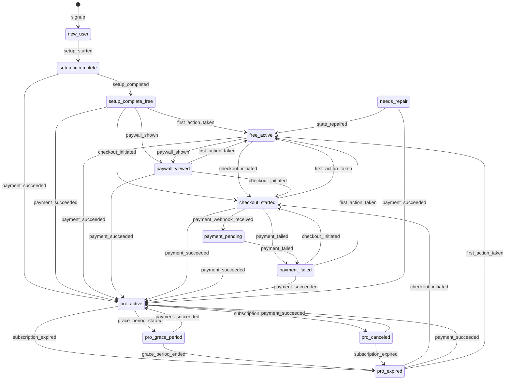

# VistaCEO - Auditoría Zero-Failure

## 📊 ETAPA 1: Mapa de Estados del Usuario

### Estados Definidos

| Estado | Label | Descripción | Puede usar Pro | Mostrar Paywall |
|--------|-------|-------------|----------------|-----------------|
| `new_user` | Usuario nuevo | Acaba de registrarse | ❌ | ❌ |
| `setup_incomplete` | Setup incompleto | Configuración inicial pendiente | ❌ | ❌ |
| `setup_complete_free` | Free (nuevo) | Terminó setup, plan gratuito | ❌ | ✅ |
| `free_active` | Free activo | Usuario free usando la app | ❌ | ✅ |
| `paywall_viewed` | Vio paywall | Ha visto la oferta Pro | ❌ | ✅ |
| `checkout_started` | En checkout | Iniciando proceso de pago | ❌ | ❌ |
| `payment_pending` | Pago pendiente | Esperando confirmación de pago | ❌ | ❌ |
| `payment_failed` | Pago fallido | El último intento de pago falló | ❌ | ✅ |
| `pro_active` | Pro activo | Suscripción Pro activa | ✅ | ❌ |
| `pro_grace_period` | Pro (gracia) | Pro expirado, en período de gracia (7 días) | ✅ | ✅ |
| `pro_canceled` | Pro cancelado | Canceló pero tiene acceso hasta vencimiento | ✅ | ✅ |
| `pro_expired` | Pro expirado | Suscripción Pro vencida | ❌ | ✅ |
| `needs_repair` | Necesita reparación | Estado inconsistente detectado | ❌ | ❌ |
| `admin` | Administrador | Usuario con permisos de admin | ✅ | ❌ |

### Transiciones Válidas



### Reglas de Reparación Automática

| Condición | Estado Objetivo | Acción |
|-----------|-----------------|--------|
| Subscription active pero settings.plan ≠ 'pro' | `pro_active` | Actualizar settings.plan a 'pro' |
| Setup incompleto con negocio | `setup_incomplete` | Forzar redirect a /setup |
| Sin negocio pero con perfil | `new_user` | Crear negocio o redirect |
| Subscription expirada pero status='active' | `pro_expired` | Actualizar status y settings |

---

## 📋 ETAPA 2: Auditoría por Módulo

### 2A) Dashboard Principal

| Check | Estado | Prioridad |
|-------|--------|-----------|
| Usuario nuevo ve onboarding card | ✅ Implementado | P0 |
| Usuario recurrente ve métricas | ✅ Implementado | P0 |
| Panel vacío muestra CTA de acción | ⚠️ Revisar | P1 |
| Skeletons durante carga | ✅ Implementado | P1 |
| Tiempo de carga < 2s | ⚠️ Medir | P2 |
| Mobile scroll optimizado | ✅ Implementado | P1 |

### 2B) Chat CEO

| Check | Estado | Prioridad |
|-------|--------|-----------|
| Persistencia de mensajes | ✅ Implementado | P0 |
| Retry en error de envío | ⚠️ Parcial | P1 |
| Genera LEARNING_EXTRACT | ✅ Implementado | P0 |
| Alimenta Radar/Misiones | ⚠️ Revisar pipeline | P1 |
| Memoria de 3 niveles | ❌ Por implementar | P2 |
| Límite Free (3 msg/mes) | ✅ Implementado | P0 |

### 2C) Misiones

| Check | Estado | Prioridad |
|-------|--------|-----------|
| Máximo 3 activas simultáneas | ⚠️ Sin límite actual | P0 |
| Dedupe semántico | ✅ brain-quality-gate | P0 |
| KPI obligatorio | ⚠️ Opcional actual | P1 |
| Quality gate pre-publicación | ✅ Implementado | P0 |
| Checklist score > 60 | ✅ Implementado | P1 |

### 2D) Radar

| Check | Estado | Prioridad |
|-------|--------|-----------|
| Límite diario/semanal | ❌ Sin límite | P0 |
| Score mínimo 65 | ✅ Implementado | P0 |
| Dedupe contra histórico | ✅ concept_hash | P0 |
| Evidencia obligatoria | ✅ basedOn required | P0 |
| Diversidad por categoría | ⚠️ Parcial | P1 |

### 2E) Analytics

| Check | Estado | Prioridad |
|-------|--------|-----------|
| Input manual de métricas | ⚠️ Parcial | P1 |
| Validación de valores | ❌ Por implementar | P1 |
| Insights con causa probable | ⚠️ Revisar | P1 |
| Puente con Misiones | ⚠️ Manual | P2 |

### 2F) Predicciones (Pro)

| Check | Estado | Prioridad |
|-------|--------|-----------|
| Inputs mínimos requeridos | ✅ Implementado | P0 |
| Escenarios A/B/C | ✅ Implementado | P0 |
| Calibration events | ✅ Implementado | P1 |
| Solo Pro | ✅ ProFeatureGate | P0 |

---

## 📊 ETAPA 3: Free vs Pro

### Matriz de Funcionalidades

| Funcionalidad | Free | Pro |
|---------------|------|-----|
| Misiones activas | 3/mes | Ilimitadas |
| Chat IA | 3 msg/mes | Ilimitado |
| Radar oportunidades | 3/mes | Ilimitado |
| Analytics básico | ✅ | ✅ |
| Predicciones | ❌ | ✅ |
| Voz/Audio chat | ❌ | ✅ |
| Análisis de fotos | ❌ | ✅ |
| Integraciones premium | ❌ | ✅ |

### Tests de Pago Obligatorios

- [ ] Compra exitosa MercadoPago (AR)
- [ ] Compra exitosa PayPal (otros países)
- [ ] Pago pendiente → confirmación tardía
- [ ] Pago fallido → retry
- [ ] Webhook duplicado (idempotencia)
- [ ] Reembolso
- [ ] Usuario en 2 dispositivos simultáneos
- [ ] Cambio plan mensual → anual

---

## 🔧 ETAPA 4: Integraciones

### Resend (Emails)

| Check | Estado |
|-------|--------|
| Idempotencia (no duplicar) | ✅ |
| Retries con backoff | ⚠️ Revisar |
| Logs por usuario/template | ✅ |
| Template welcome-email | ✅ |

### Pagos

| Check | Estado |
|-------|--------|
| Webhook idempotencia | ✅ payment_id único |
| Verificación de firma | ⚠️ Revisar |
| Repair job (pago ok, plan no cambió) | ✅ audit-user-state |

### Admin

| Check | Estado |
|-------|--------|
| Vista estado usuario | ✅ |
| Logs de actividad | ✅ |
| Reparar plan manual | ⚠️ Por implementar |
| Reenviar email | ⚠️ Por implementar |

---

## 🛡️ ETAPA 5: Confiabilidad (SRE)

| Componente | Estado |
|------------|--------|
| Error boundaries | ✅ React ErrorBoundary |
| Logs estructurados | ✅ Supabase logs |
| Monitoreo jobs | ⚠️ Revisar pg_cron |
| Alertas automáticas | ❌ Por implementar |
| Auto-repair | ✅ audit-user-state |

---

## 🎯 ETAPA 6: Pipeline de Auditoría Pre-Publicación

### Flujo Obligatorio

```
1. Recolectar contexto (perfil + setup + negocio + últimos chats + métricas)
     ↓
2. Generar candidatos (radar/misiones/insights)
     ↓
3. Scoring multi-factor:
   - Relevancia (0-100)
   - Personalización (0-100)
   - Novedad (0-100)
   - Coherencia (0-100)
   - Accionabilidad (0-100)
     ↓
4. Dedupe semántico (cluster + merge)
     ↓
5. Rate limiter (top N, diversidad por categoría)
     ↓
6. Umbral mínimo → Si falla, regenerar o preguntar
     ↓
7. Publicación
     ↓
8. Tracking
     ↓
9. Auto-repair si métricas malas
```

### Umbrales por Tipo

| Tipo | Score Mín | Relevancia Mín | Novedad Mín | Max/Día | Max/Semana |
|------|-----------|----------------|-------------|---------|------------|
| Opportunity | 65 | 70 | 80 | 3 | 10 |
| Mission | 70 | 75 | 85 | 2 | 5 |
| Insight | 60 | 65 | 70 | 5 | 20 |
| Prediction | 75 | 80 | 60 | 2 | 8 |

---

## 📈 ETAPA 7: KPIs del Sistema

| Métrica | Target | Actual |
|---------|--------|--------|
| Activación (setup completo) | > 60% | Medir |
| Retención D1 | > 40% | Medir |
| Retención D7 | > 25% | Medir |
| Retención D30 | > 15% | Medir |
| Conversión a Pro | > 5% | Medir |
| Mission completion rate | > 30% | Medir |
| Radar action rate | > 20% | Medir |
| Tickets/bugs por 1k usuarios | < 5 | Medir |

---

## ✅ CHECKLIST FINAL "NO PUEDE FALLAR"

- [x] Máquina de estados implementada
- [x] Hook useUserLifecycle creado
- [x] Pipeline de auditoría creado
- [x] Edge function audit-user-state deployada
- [ ] Límites de Radar/Misiones en UI
- [ ] Tests E2E de pagos
- [ ] Alertas automáticas
- [ ] Dashboard admin con repair
- [ ] Mobile QA completo

---

## 📁 Archivos Creados

```
src/lib/user-lifecycle/
├── index.ts              # Exports
├── state-machine.ts      # Estados + transiciones + repair rules
└── audit-pipeline.ts     # Scoring + dedupe + rate limiting

src/hooks/
└── use-user-lifecycle.ts # Hook principal

supabase/functions/
└── audit-user-state/     # Auto-repair edge function
```
